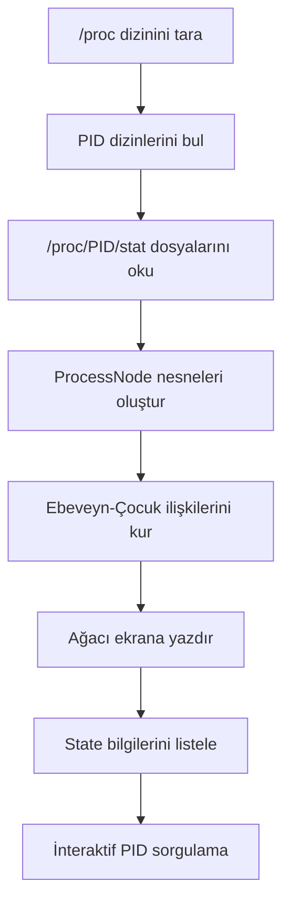

# 🌳 Linux Süreç Ağacı Görüntüleyici (Process Tree Viewer)

Linux işletim sisteminde çalışan tüm süreçleri **ağaç yapısında** görselleştiren ve her bir sürecin detaylı bilgilerini sunan bir **C++ shell uygulamasıdır**.

## 📸 Örnek Çıktı

```
Sistem Süreç Ağacı:
└── systemd [1]
    ├── sshd [850]
    │   └── bash [1234]
    ├── cron [512]
    └── rsyslogd [480]

======================================================================
TÜM SÜREÇLERİN STATE BİLGİSİ:
======================================================================
PID       | Proses Adı           | Durum           | Parent PID
----------------------------------------------------------------------
1         | systemd              | Sleeping        | 0
850       | sshd                 | Sleeping        | 1
...
```

## ✨ Özellikler

- **Süreç Ağacı Görselleştirme** — `/proc` dosya sistemini tarayarak tüm süreçleri ebeveyn-çocuk ilişkileriyle ağaç formatında gösterir.
- **State Bilgisi Listeleme** — Tüm süreçlerin PID, isim, durum (Running, Sleeping, Zombie vb.) ve Parent PID bilgilerini tablo formatında listeler.
- **Interaktif Süreç Sorgulama** — Kullanıcıdan PID alarak ilgili sürecin `/proc/[pid]/stat` dosyasından detaylı analiz sunar:
  - PID, Proses Adı, Durum
  - Parent PID, Process Group, Session ID
  - User Time, System Time (jiffies)
  - Priority, Nice değeri
  - Virtual Memory kullanımı
- **Bellek Yönetimi** — Dinamik olarak oluşturulan ağaç yapısı, program sonunda düzgün bir şekilde temizlenir (post-order traversal ile `cleanup`).

## 🛠️ Gereksinimler

| Gereksinim | Açıklama |
|---|---|
| **İşletim Sistemi** | Linux (`/proc` dosya sistemi gereklidir) |
| **Derleyici** | `g++` (C++17 veya üstü) |
| **Kütüphaneler** | Standart C/C++ kütüphaneleri (`dirent.h`, `iostream`, `vector`, `unordered_map`) |

## 🚀 Kurulum ve Çalıştırma

### 1. Depoyu Klonlayın

```bash
git clone https://github.com/MertKadakal/pid-list-query.git
cd pid-list-query
```

### 2. Derleyin

```bash
g++ -std=c++17 -o processtree main.cpp
```

### 3. Çalıştırın

```bash
./processtree
```

> [!NOTE]
> Bazı süreç bilgilerine erişmek için root yetkisi gerekebilir. Bu durumda `sudo ./processtree` ile çalıştırabilirsiniz.

## 📂 Proje Yapısı

```
.
├── main.cpp        # Ana kaynak dosyası (tüm uygulama mantığı)
└── README.md       # Proje dokümantasyonu
```

## 🔧 Teknik Detaylar

### Kullanılan Veri Yapıları

- **`ProcessNode` struct** — Her sürecin bilgisini (`pid`, `ppid`, `name`) ve çocuk süreçlerin listesini tutar.
- **`unordered_map<int, ProcessNode*>`** — PID bazlı hızlı erişim sağlayan hash map yapısı.

### Çalışma Mantığı



### Süreç Durumları

| Kod | Durum | Açıklama |
|-----|-------|----------|
| `R` | Running | Süreç çalışıyor veya çalışmaya hazır |
| `S` | Sleeping | Süreç bir olayı bekliyor |
| `D` | Disk Sleep | Kesintisiz uyku (genellikle I/O) |
| `Z` | Zombie | Süreç sonlandı ancak parent henüz beklemedi |
| `T` | Stopped | Süreç durduruldu (sinyal ile) |

## 📝 Lisans

Bu proje açık kaynak olarak sunulmaktadır. Eğitim ve geliştirme amaçlı serbestçe kullanılabilir.

## 👤 Geliştirici

**Mert Kadakal** — [GitHub Profili](https://github.com/MertKadakal)
